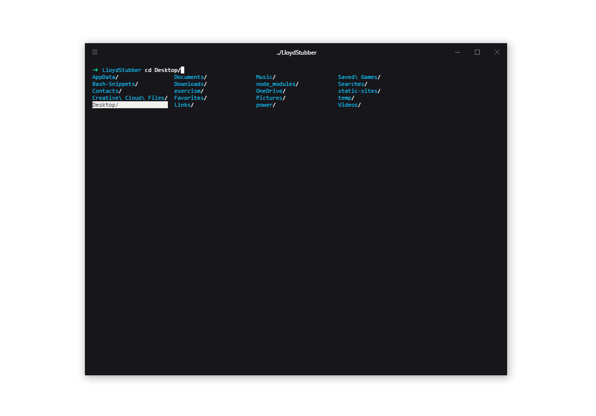

# My WSL Setup for Development
Quick rundown on my current setup  Windows Subsystem for Linux.


After a few headaches with running the Git Bash on Windows I’ve decided to move over the WSL for all development purposes. I’m very new to Linux so this is a very top-level overview so feel free to submit any changes.



Here’s a breakdown of how I got up and running below:


### Download & Install the WSL
- Follow the very thorough instructions [here](https://msdn.microsoft.com/en-au/commandline/wsl/install_guide)


### Get your terminal looking pretty pt.1
- Download Hyper.js [here](https://hyper.is/)
  - I went with the 'hyperblue' theme


### Automatically open in Bash
- Open up Hyper and type `Ctrl` + `,`
- Scroll down to shell and change it to `C:\\Windows\\System32\\bash.exe`


### Install Zsh
- Run this `sudo apt-get install zsh`
- Open your bash profile `nano ~/.bashrc`
- Add this to set it to use ZSH as default:
```
if [ -t 1 ]; then
exec zsh
fi
```

### Get your terminal looking pretty pt.2
- Install Oh My Zsh with `sh -c "$(curl -fsSL https://raw.githubusercontent.com/robbyrussell/oh-my-zsh/master/tools/install.sh)"`
  - Read docs [here](https://github.com/robbyrussell/oh-my-zsh) on how to add more plugins and change themes (I went with their out of the box 'robbyrussell').

### Fix the ls and cd colours
- Out of the box when you `ls` or `cd` + `Tab` you get some nasty background colours on the directories. To fix this, crack open your ~/.zshrc file and add this to the end:
```
#Change ls colours
LS_COLORS="ow=01;36;40" && export LS_COLORS

#make cd use the ls colours
zstyle ':completion:*' list-colors "${(@s.:.)LS_COLORS}"
autoload -Uz compinit
compinit
```

### Install Git
- Run this `sudo apt update`
- Then run `sudo apt install git`


### Setup a SSH key and link to your Github
- Follow the Linux steps [here](https://help.github.com/articles/generating-a-new-ssh-key-and-adding-it-to-the-ssh-agent/#platform-linux) to create a key and add it to your SSH agent
- Then type `cat ~/.ssh/id_rsa.pub`
- Copy your key from the terminal and paste it into your Github keys


### Install N (alternative to Node Version Manager)
- My shell was running slow with nvm so I switched to [n](https://github.com/mklement0/n-install). Just install it with their curl command and if n doesn't work as a command on zsh, it would have installed it's path into your ~/.bashrc so just copy it over to your ~/.zshrc.


### Install Gulp CLI
- Follow the Gulp docs [here](https://github.com/gulpjs/gulp/blob/master/docs/getting-started.md).

### Aliases
- Just to test out using aliases, I picked a few things I type a lot into the terminal that could save me some keystrokes. Add this to your .zshrc file to do the same and add anything else you see fit.
```
# aliases for git
alias ga='git add -A'
alias gs='git status'
alias gps='git push -u origin master'
```
---

### Notes
- I had trouble with Node/npm/Gulp before realising Ubuntu won’t automatically upgrade from 14.04 to 16.04 - as mentioned in this [article](https://blogs.msdn.microsoft.com/commandline/2017/04/11/windows-10-creators-update-whats-new-in-bashwsl-windows-console/).
  - If you’re in the same boat, upgrade via these [instructions](https://help.ubuntu.com/lts/serverguide/installing-upgrading.html).
- I also had trouble with older versions of Windows 10 not liking Gulp via the WSL - inotify and socket issues. Make sure you're running on the Creators Update or Insiders Program versions.
- A lot of Hyper plugins don't work with Windows so make sure to check before installing them.

### Easter Eggs
- A few goodies I installed recently for fun:
  - Cowsay `sudo apt-get install cowsay`
  - htop `sudo apt-get install htop`
  - Isn't via apt-get but [Bash-Snippets](https://github.com/alexanderepstein/Bash-Snippets) is great
